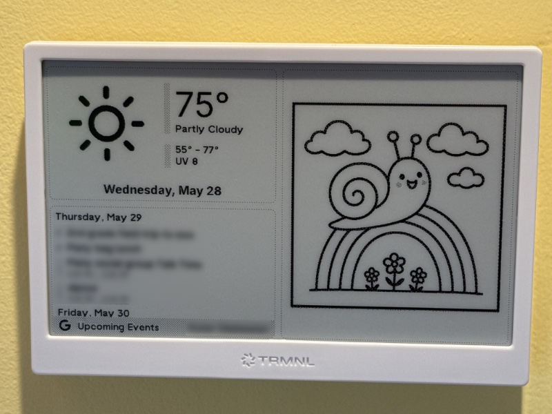

Generates a capybara or platypus image to match the weather, for
our [TRMNL](https://usetrmnl.com/).

Idea and descriptions from [reddit user dust_free](https://www.reddit.com/r/trmnl/comments/1kwk04m/axolotl_weather_display/).

